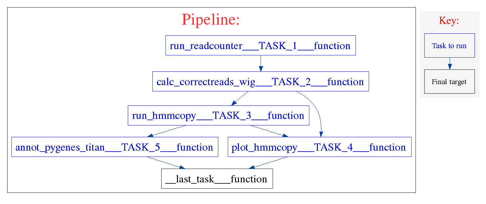

================
HMMcopy workflow 
================
.. topic:: Development information

    * Date Created : 21 Jan 2015
    * Last Update  : 22 Apr 2015
    * Developer    : Diljot Grewal (dgrewal@bccrc.ca)

.. here you can add the workflow plot

HMMcopy workflow takes a bam file as an input and makes copy number estimations for the whole genome data with GC and mappability correction.
It also segments and classifies the copy number profiles with a robust Hidden Markov Model.
The workflow follows these steps:

* Generate wig files from the sample (run_readcounter_TASK_1)
* Apply correction to the wig files (using map and gc wig files) (calc_correctreads_wig_TASK_2)
* Run HMMcopy to perform copy number estimations (run_hmmcopy_TASK_3)
* Plot the bias and corrections for the Wig file correction step (plot_HMMcopy_TASK_4)
* Generate plots for the copy number estimation. (plot_HMMcopy_TASK_4)
* Annotate the segment results from HMMcopy (annot_pygenes_titan_TASK_5)

Components
==========
* *component 1*:

 * component_name: `calc_correctreads_wig <https://github.com/MO-BCCRC/calc_correctreads_wig>`_
 * component_version: 1.1.3
 * seed_version: 0.1.1

* *component 2*:

 * component_name: `annot_pygenes <https://github.com/MO-BCCRC/annot_pygenes>`_
 * component_version: 1.1.5
 * seed_version: 1.0.2

* *component 3*:

 * component_name: `run_hmmcopy <https://github.com/MO-BCCRC/run_hmmcopy>`_
 * component_version: 1.0.1
 * seed_version: 1.0.1

* *component 4*:

 * component_name: `run_readcounter <https://github.com/MO-BCCRC/run_readcounter>`_
 * component_version: 1.1.3
 * seed_version: 1.0.0

* *component 5*:

 * component_name: `plot_hmmcopy <https://github.com/MO-BCCRC/plot_hmmcopy>`_
 * component_version: 1.0.1
 * seed_version: 1.0.1
     
Requirements
============
* Kronos >=v2.0.4
* Python >= v2.7.6
* R >= 3.1.1
* `HMMCopy <http://compbio.bccrc.ca/software/hmmcopy/>`_ 
* `Pygenes <https://bitbucket.org/dranew/pygenes>`_

How to run the workflow
=======================    
**Step 1.** Update the ``setup.txt`` file provided with the workflow by passing proper paths/values to the *value* column.

.. note::

    The above file is a tab separated file and the first line, *i.e.* '``#section key value``', is part of the file.
    
**Step 2.** Update the ``input.txt`` file with proper paths/values.

.. note::

    The above file is a tab separated file and the first line, *i.e.* '``#sample_id ...``', is part of the file.
    Sample ID's are arbitrary.
    However, they cannot be used more than once in an input file.
      
**Step 3.** Run the workflow using the following command:

.. code:: bash
 
     kronos run -c <path/to/components_dir/ -e <a name for workflow> 
                -i <input.txt> -r <run_id> -s <setup.txt>  
                -w <workind_dir> -y <path/to/config.yaml>

Please note to replace ``<.>`` with the actual values.
See kronos online documentation for more information on the `run <http://kronos.readthedocs.org/en/latest/launch_pipeline/run.html#how-to-run-pipeline>`_ command.

Outputs
=======
The resulting files will be saved in the <working_dir>/<run_id> directory.
For this workflow, the final result files are:

* run_readcounter:

    * infile.wig : wig file for the sample specified in \_\_SAMPLES\_\_ section

* correctreads:

    * infile_copy.txt : the corrected read counts
    * infile_copy.obj : the corresponding R object

* hmmcopy:

    * hmmcopy_segments.txt: the segments estimated by the HMMcopy
    * hmmcopy_res.obj:  the corresponding R object
    * tumour_correctreads_with_state.txt: the corrected reads counts with their corresponding state.

* plots:
  
    * correction : the correction plots for the GC and mappability correction step (separate plots for each chromosome)
    * bias.pdf : the bias plts (for the GC and mappability correction step)
    * hmmcopy : the segments plots ( separate plots for each chromosome)

* pygenes:

    * {sample_id}_hmmcopy.seg.pygenes : Pygenes annotated segments
      
Please refer to the Kronos online documentation for more information on the structure of the `results directory <http://kronos.readthedocs.org/en/latest/launch_pipeline/run.html#results-generated-by-a-pipeline>`_.

Changelog
=========
* v1.4: Added support for the new shahlab cluster
* v1.2: The workflow generates a copy of the corrected readcounts which includes the state information.
* v1.1: The workflow now generates the correction plots for all chromosomes.
  The plots are saved in a directory in the results/plots/ folder.

